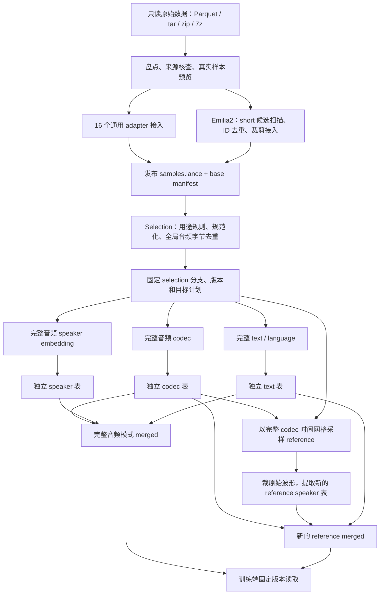

# 仓库全流程：从原始数据到可读取的 TTS 特征

本文按 2026-10-09 的仓库实现梳理整个 pipeline，解释各阶段做什么、读写什么，以及它们如何对应。
字段的规范定义以 [data contract](data-contract/README.md) 为准；本文是代码和运行流程总览，不是新的契约。
实时进度以运行目录的状态、日志和正式 manifest 为准，不使用历史文档里的 ETA 判断任务是否完成。

## 1. 总体流程与职责边界

仓库交付两层数据：一是统一的基础音频样本，二是固定样本集合上的模型特征和文本。
训练端使用这些产物，负责训练数据配方、文本 token 化、采样、batch、loss mask 和模型训练。



图里的依赖不意味着必须串行执行：固定目标计划之后，普通 codec、整条 speaker 和 text 可以独立运行。
Reference speaker 则需要已经发布的完整 codec，用它确定实际时间轴和片段对应的帧区间。
两种 merged 都是额外产物，保留各自的 codec、speaker、text 来源表。

当前没有一个覆盖所有阶段的通用“一键全量”入口。`scripts/` 提供正式阶段入口；
`artifacts/` 中的 `production_chain.py`、暂停/恢复监控等，是固定某次任务的编排脚本，不是公共 CLI。
Emilia2 当前授权的生产范围止于基础 samples；图中的下游路线不代表它已经进入 selection 或 feature 提取。

## 2. 代码从哪里看

| 路径 | 职责 |
| --- | --- |
| `scripts/tts_data.py` → `cli.py` | 盘点、标量统计、预览、小规模转换、通用全量转换 |
| `adapters/` | 逐数据集解释来源文件、音频/文本配对、身份与字段映射 |
| `schema.py`、`timestamps.py` | 基础 Arrow schema、记录校验、哈希身份和时间字段工具 |
| `inventory.py`、`preview.py` | 接入前核查，不负责正式全量发布 |
| `convert.py`、`bulk.py`、`writer.py` | 转换、任务划分、Lance fragment 写入、回读、恢复和发布 |
| `source_exclusions.py` | 有证据、有源文件摘要的明确排除策略 |
| `ingest/emilia2/`、`audio_io.py` | Emilia2 独立接入；固定 FFmpeg 的 AAC/M4A 读取支持 |
| `selection.py` | 固定基础快照、扫描规则、全局去重、发布 selection 分支 |
| `codec/qwen3_12hz/` | Qwen3 tokenizer 的前处理、packed 推理、调度、存储与发布 |
| `speaker/qwen3_ecapa/` | FP32 ECAPA 前处理、packed 推理、reference 采样、存储与发布 |
| `text/` | 选用文本和语言的独立物化 |
| `merge_features.py` | 三表身份核对、区间验证、合并、reference 失败过滤和发布 |
| `feature_audio.py`、`feature_runtime.py`、`feature_contract.py` | 共用特征读取/时间轴、任务与文件摘要、profile/覆盖校验 |
| `contract.py`、`manifests.py` | 契约类型与 manifest 读取兼容逻辑 |
| `tests/` | 接入、身份、selection、特征、合并、恢复及契约回归 |

表中未写前缀的 Python 路径均位于 `src/tts_data_pipeline/`。
生产源码在 `src/`，入口在 `scripts/`；任务 JSON、检查点、性能数据不属于源码。

## 3. 数据放在哪里

```text
原始根目录/                         # 只读，例如 /workspace/data/DATA-TTS
DATA-TTS-UNIFIED/
├── README.md、CONTRACT.md、specs/、schemas/、examples/
├── datasets/<dataset_id>/<release_id>/
│   ├── manifest.json              # 基础表的固定发布快照
│   ├── samples.lance/             # 原始编码音频 bytes + 基础元数据
│   │                              # selection 使用该表的独立 branch
│   └── features/
│       ├── codec/<run_id>/{manifest.json,features.lance/}
│       ├── speaker_embedding/<run_id>/{manifest.json,features.lance/}
│       ├── text/<run_id>/{manifest.json,features.lance/}
│       └── merged/<run_id>/{manifest.json,features.lance/}
│                                  # reference merged 另有 targets.lance
└── selections/<selection_id>/
    ├── manifest.json、rules.json、exclusions.jsonl、exclusion_changes.jsonl
    └── duplicates.lance/

tts-data-pipeline/
├── configs/                       # 规则、明确排除清单、环境配置
├── cache/feature-models/           # 固定模型权重与来源清单
├── cache/audio-tools/             # 固定的音频工具，例如 FFmpeg
├── artifacts/                     # 验证数据、工作计划、冻结 runtime、运行编排
├── reports/                       # 日志、active.json、启动记录
└── docs/                          # 说明、契约源稿与历史验证证据
```

工作状态也可能在 `datasets/<dataset_id>/.state/<release_id>/`，实际位置由计划记录。
`annotations/` 的分支/一对多表布局已在契约中定义，但本仓库没有通用的 ASR、VAD、对齐、质量标注执行器。
`views`、`builds`、`training_plans`、`assets` 不是当前统一数据层的发布流程；训练构建归训练仓库管理。

Lance 表是引擎管理的目录与快照，不是一个文件。基础数据文件目标约 1 GiB，是软限制。
训练读取必须固定 manifest 指向的 branch/version，不能把 `data/*.lance` 的 glob 当成整张表。

## 4. 第一阶段：盘点和基础样本接入

### 4.1 通用 adapter 路径

入口：`scripts/tts_data.py`。支持的子命令是 `inventory`、`scalars`、`preview`、`convert`、`bulk`。

1. **盘点与预览**：确认容器、清单、来源字段、音频配对和来源范围；`preview` 最多核查 32 条真实记录。
2. **固定输入**：记录来源文件及语义依赖的摘要，应用明确批准的 exclusions；未知坏包不能自动当作排除策略。
3. **adapter 逐条映射**：生成统一的 27 列基础记录，保留原始音频 bytes、原文、来源 locator 和上游元数据。
4. **并行写片段**：worker 生成未提交 Lance fragments，检查记录、音频摘要/头信息并完整回读。
5. **协调发布**：核对完整来源、全局身份和行数，统一 commit、建立索引，固定 Lance 版本，发布 complete manifest。

默认不统一重采样、重编码或强制转 FLAC。`source_split=train` 是统一基础层的输出约定，
上游 split/config 另存元数据；它不代表已完成训练/评估隔离。
来源中的未知 speaker、language、text 等按 adapter 规则保留为空，不伪造内容。

当前通用注册表包含以下 16 个 adapter：

| 类别 | CLI dataset_id |
| --- | --- |
| 朗读/语音库 | `aishell3`、`csemotions`、`ljspeech`、`vctk`、`hifitts`、`hifitts2`、`libritts_r`、`libriheavy`、`mls_sidon`、`wenetspeech4tts` |
| 游戏音频 | `genshin_voice`、`starrail_voice`、`galgame`、`wutheringwaves` |
| Emilia 系列 | `emilia`、`emilia_yodas` |

各来源字段与特殊处理见 [datasets.md](datasets.md)，恢复和来源排除见 [bulk-conversion.md](bulk-conversion.md)。
`bulk` 按源容器/输入组调度，增加 worker 不能让单个不可拆压缩包自动并行。
Standard 验证包括全量记录/字节摘要/音频头/Lance 回读/身份检查；`--deep-verify` 才额外完整解码。
“基础发布通过”不能自动解释成全库听检或音文对齐通过。

### 4.2 Emilia2 独立接入路径

入口：`scripts/ingest_emilia2.py`，没有注册成 `tts_data.py bulk emilia2`。

| 阶段 | 输入与处理 | 工作产物 |
| --- | --- | --- |
| `plan` | 枚举并固定 tar/idx 来源集合 | `work/plan.json` |
| `scan` | 检查成员配对、JSON 标注、整数采样区间，生成所有 short 候选 | `work/metadata/*.parquet` 与校验 JSON |
| `dedup` | 全局按上游 short ID 分组，检查语义冲突，选择有效代表 | `work/winners/*.parquet`、`dedup.json`、排除清单 |
| `run` | 验证去重结果，读取代表音频、裁剪、写入、回读、全局核对并发布 | `work/converted/*.json`、新基础 release |

三条接入路线一起参与去重：

- `short` 成员：原样接入该独立短音频的完整编码 bytes，M4A 仍是 M4A。
- `long` 成员：解码承载音频，按内部 short 标注裁出每个短段。
- `dialogue` 成员：同样按内部 short 标注裁短段，不只读取名为 short 的成员。

有效候选优先；同一 ID 优先独立 short，其次 long、dialogue，同类型优先 128 kbps，再使用固定顺序。
文本、语言、speaker、recording 的语义冲突会排除该 ID，而不是任意选一个。
这是上游 ID 去重；不代替 selection 中按完整音频字节 SHA256 的跨数据集去重。

裁剪坐标是承载音频的原生整数采样点 `[start,end)`，不重采样、不补零。
短段通常编码为 FLAC PCM24；超出 PCM24 可表示幅度时用 FLOAT WAV，避免削波。
量化误差经读回验证，PCM24 上限为 `2^-24`；独立 short 不做这种重编码。
来源承载音频的区间放在 locator/metadata 中；没有一个已发布的 Lance 父样本，因而不伪造 parent 引用。

Emilia2 会完整解码并回读验证。单条不可解码或终点越过真实音频等问题记录原因；
普遍性音频失败、来源变化、身份/计数不一致停止任务，不能静默跳过大量数据。
候选、去重排除和转换检查点会随基础 release 保留审计信息。
AAC 支持目前接入基础验证路径；不能因此假定现有 codec/speaker 已支持直接处理 Emilia2 的 M4A。

## 5. 第二阶段：Selection 决定训练目标集合

入口：`scripts/build_selection.py`；实现：`selection.py`。
它不复制整份音频，而是在各 `samples.lance` 的固定基础版本上建立独立 selection 分支。

流程为 `plan → scan → deduplicate → publish`，`run` 连续执行后三步：

1. 固定所有输入 manifest、基础快照、规则文件、已审阅排除证据和扫描任务。
2. 对每条样本记录主排除原因和全部命中 flags；保留未入选记录。
3. 基于完整 `audio_sha256` 全局分组，检查候选文本/语言冲突，以固定来源优先级和 sample ID 选代表。
4. 写稀疏 `selected_text/selected_language` 覆盖值，核验全部分支、基础快照保护和重复证据后发布。

当前首版规则是 1–120 秒（含边界）、有效文本、支持语言、明确排除项和精确音频字节去重。
文本仅按规则 strip；语言只做明确 alias 映射。覆盖语义为“非 null 才覆盖”，不能用 Python `or`。
不同编码的同一句、近重复、同录音的重叠片段，不属于字节哈希去重的保证范围。

当前执行器只支持首个独立 selection 和完整 sample，尚未实现新的裁剪产物发布、任意后继 selection 继承、
或新 annotation 文本来源的完整绑定。新增数据集不能直接追加到已经发布的 selection 中。
规则及实现边界见 [selection.md](selection.md) 和 [契约 12](data-contract/specs/12-selections.md)。

### 三种“裁剪”不能混在一起

| 类型 | 在哪里做 | 对目标身份、text、codec 的影响 |
| --- | --- | --- |
| 上游已经定义的短样本接入 | Emilia2 ingest | 把承载音频里的 upstream short 转成基础 sample；配它自己的 short 文本 |
| 训练目标需要重新切段 | selection 的未来裁剪执行器 | 应生成新样本身份和片段文本；当前未实现，不能假装登记区间就完成了 |
| Speaker reference 子片段 | reference speaker 提取 | 保留原目标 sample ID、完整 text 和完整 codec；只改变条件 embedding 的输入区间 |

“当前 selection branch 只支持整条 sample”是实现限制，不是所有数据集永远无需切分的结论。
也不能拿上游原录音时间戳，直接再切一次已经切好的当前音频。

## 6. 第三阶段：固定目标并独立提取特征

`extract_codec.py plan` 固定已发布 selection 的目标、分支、版本、任务成员及有序 ID 摘要。
整条 speaker 和 text 可以复用这个目标计划；复用计划不等于必须等 codec 推理完成。
计划、模型、profile 和验收文件必须一致；`acceptance.json` 是实际验证证据，不是随意填写的开关。

### 6.1 Codec

入口：`scripts/extract_codec.py`；实现：`codec/qwen3_12hz/`。

实际解码整条波形 → 声道处理 → codec 自己的 24 kHz 重采样 → 真实长度调度与 packed 推理 →
RVQ → `int16 [T,16]` codes → 任务回读校验 → 追加并核对选用文本元数据 → 发布。
每码本 2048 个值；时间步长为 `1920 / 24000 = 80 ms`，即 12.5 帧/秒。

保留 BF16 和 FP32 路径，当前默认/生产使用 FP32。FP32 packed 内核使用 TF32x3 补偿乘法，
不能描述为与官方逐位等价的严格 IEEE 运算。参考标准是独立的官方同 dtype、单条、实际长度推理。
底层归约顺序可能导致少量离散码差异；无逐长度 policy，也不为新数据集穷举形状。

没有外部 batch padding，保留模型自身的因果、stride、边界处理。
头信息长度只用于调度；输入、区间和指纹按实际解码长度生成，不因一两帧头信息差异补零或截尾。
详细模块、精度和验收边界见 [codec.md](codec.md)。其中历史 C/FP16 的运行记录不代表当前生产算法。

### 6.2 完整音频 Speaker embedding

入口：`scripts/extract_speaker.py`；实现：`speaker/qwen3_ecapa/`。

完整实际解码波形 → FP32 声道均值 → torchaudio sinc 重采样到 24 kHz → GPU mel →
ECAPA packed 推理 → 原始 1024 维 float32 embedding → 回读校验 → 发布。
不做额外 L2 归一化，不按 speaker 标签共享/平均 embedding，不把零向量用作失败替代。

批处理只拼接真实帧，用 offsets 隔离样本边界、SE 统计和 attentive pooling。
模型原生反射边界保留；不做 waveform/mel batch padding。
固定原生单条 FP32 参考容差 `atol=1e-5, rtol=1e-4`；写盘回读和摘要核对仍是精确比较。
Speaker 使用自己的重采样算法，不能与 codec 的输入波形摘要直接要求相等。

GPU 数、每卡 worker 数、解码线程和 mel 帧预算是调度参数；不授权修改裁剪、精度或 padding 语义。
完整参数和多 worker 验证见 [speaker.md](speaker.md)。

### 6.3 Text

入口：`scripts/extract_text.py`；实现：`text/`。
只读取固定 selection 的最终文本、语言、修订及来源，输出独立 text 表；不读音频、不做推理、
不生成 token、不重新转写、不再次清洗。每个数据集由一名 CPU worker 处理，可并行多个数据集。
格式或来源不符合约定时停止，不以空白文本代替。见 [text.md](text.md)。

### 6.4 Reference Speaker embedding

这是新增的 speaker run，不覆盖原整条 embedding。输入是基础音频/selection，加上独立完整 codec 的固定快照。
`--reference-sources-plan` 目前接收已有合表计划，从中取得 codec manifest；不读取旧 merged payload。

1. 从 codec 的实际解码长度建立完整帧时间网格，计算满足约束的帧长度和起点。
2. 每个目标确定一个 reference：占完整音频 10%–50%，至少 0.5 秒，无额外绝对上限。
3. 用稳定身份、seed 和策略版本确定结果，先把采样计划持久化，再推理；重试和 worker 数变化不改片段。
4. 解码原始音频并严格核对 codec 时间轴，先裁出 reference 波形，再做 speaker 前处理和推理。
5. 保存 embedding、原生采样区间、完整 codec 帧区间及对应 codec feature key。

映射不是按 token 总数比例估算。所有区间左闭右开：

```text
codec 区间： [a, b)
原生波形：  [ceil(a * 1920 * native_rate / 24000),
             ceil(b * 1920 * native_rate / 24000))
```

只选择完整 codec 时间帧；完整 codec 最后的不完整帧仍保留，但不进入 reference。
实际最短 reference 为 7 帧，即 0.56 秒，因此常用采样率下通常至少 1.12 秒的音频才有合法片段；
不能把“音频达到 1 秒”当作对齐后一定可用。
这些是监督时间坐标，不表示 codec token 的感受野严格局限于这段波形。

无合法片段、解码失败等记录失败行和原因，embedding 为空；不回退到完整 embedding。
来源冲突、时间映射不一致等系统性问题停止阶段。具体算法与字段见
[契约 11](data-contract/specs/11-speaker-embeddings.md) 和 `reference.py`。

## 7. 第四阶段：合并并发布新的 Merged

入口：`scripts/merge_features.py`；实现：`merge_features.py`。

`plan` 固定 codec、speaker、text 三份已发布 manifest、profile、快照和目标集合。
`run` 逐块读取，按 ID 对齐并重排，验证来源、状态、文本、区间和数值，再写新表、完整回读并发布。
连续行读取只是优化，不允许直接 zip 三张物理顺序可能不同的表。

关联键是 **`(dataset_id, release_id, target_id)`**；当前目标 `target_id=sample_id`。
`audio_sha256` 用于进一步验证来源；`feature_key`、profile、行号都不是三表关联键。
单张来源表缺失或重复目标、音频摘要不符、codec 内文本与独立 text 不同，都不能用 inner join 静默消除。

| 模式 | 核验及保留规则 |
| --- | --- |
| 整条音频 merged | 要求两侧从 0 开始、原生采样率一致；终点差在 20 ms（至少容忍 2 个采样点）内可保留各自原值并记账，超过则停止；来源特征必须成功 |
| Reference merged | 严格验证 reference 是对应完整 codec 的合法子区间，不能套用 20 ms 容差；按 speaker 失败状态显式过滤并报告原因 |

新表保留一份独立 text 的共同元数据；codec 特征列加 `codec_` 前缀，speaker 特征列加 `speaker_` 前缀。
不复制基础音频 bytes，不改变完整文本和完整 codes，不做模型推理或训练采样。
Reference merged 额外发布 `targets.lance` 表示本轮有效子集，核对输入数 = 保留数 + 按原因排除数。

训练端使用 `speaker_reference_codec_start/end` 定位 `codec_codes` 时间维中的 reference 区间。
Pipeline 不生成完整 loss mask；训练端负责预测目标位移、全部码本和 EOS 的正确监督。
原 codec、speaker、text 和旧 merged 均保留，新版本需要训练端显式切换。
完整字段和发布规则见 [契约 13](data-contract/specs/13-text-features.md)。

## 8. 身份、时间轴和版本为什么能对应

| 名称 | 用途与限制 |
| --- | --- |
| `dataset_id / release_id` | 数据来源及基础映射版本，不等同于模型版本 |
| `sample_id` | 由数据集、来源快照和来源键生成的稳定基础身份 |
| `audio_sha256` | 编码音频 bytes 的 SHA256，支持精确字节去重，不证明声学近重复 |
| `record_revision` | 基础记录内容修订，派生列不回写这个基础身份 |
| `target_id` | 特征对应哪个目标；当前完整 sample 和其 reference 条件均关联原 sample |
| `profile_id / feature_key` | 计算协议及特定音频区间的特征身份，两类 encoder 不要求相同 |
| `encoder_input_sha256` | 该 encoder 实际看到的处理后波形摘要，不等于编码文件摘要 |
| `run_id` | 一次不可覆盖的派生发布，重试只能完成同一次运行 |
| Lance branch/version | 固定读取快照；行号/fragment ID 只在该快照下有意义 |

来源文件自包含时用 `source-file-v1`；依赖外部清单时用 `source-unit-v1`；
Emilia2 的解码/裁剪映射使用包含 ingest profile 的 `source-transform-v1`。
改变 worker 数、输出分片或原始根目录不应改变业务身份；改变来源内容、映射或数值协议则需要核对新身份/新 run。
公式见 [契约 03](data-contract/specs/03-identity.md)，时间轴见 [契约 04](data-contract/specs/04-audio-timelines.md)。

## 9. 如何启动一条新流程

以下是入口模板，路径需要替换。不要在已有生产目录直接执行 `plan` 或覆盖发布；
worker 数是示例，必须根据与其他任务共跑的端到端吞吐决定。
基础接入使用 `tts-data` 环境，GPU 特征使用 `tts-features`；环境与锁定依赖见 [environment.md](environment.md)。
项目通过 `scripts/_bootstrap.py` 导入本地模块，不需要 `pip install -e .`。

```bash
# 基础接入：先预览，再正式转换。已运行任务恢复时给 bulk 加 --resume。
python scripts/tts_data.py preview libriheavy --root /path/to/raw/libriheavy \
  --snapshot preview-only --output artifacts/new-preview --limit 4
python scripts/tts_data.py bulk libriheavy --root /path/to/raw/libriheavy \
  --output /path/to/unified/datasets/libriheavy/v0.1 --workers 32

# Emilia2 使用独立入口，work 为新的工作目录。
export TTS_FFMPEG=/path/to/pinned/ffmpeg
python scripts/ingest_emilia2.py plan --root /path/to/raw/Emilia2 --work artifacts/new-emilia2
python scripts/ingest_emilia2.py scan --work artifacts/new-emilia2 --workers 8
python scripts/ingest_emilia2.py dedup --work artifacts/new-emilia2
python scripts/ingest_emilia2.py run --work artifacts/new-emilia2 \
  --output /path/to/unified/datasets/emilia2/v0.1 --workers 64

# 首个 selection；rules 必须按实际来源及用途审核。
python scripts/build_selection.py plan --root /path/to/unified \
  --work artifacts/new-selection --rules configs/selections/first-v0.1.json
python scripts/build_selection.py run --work artifacts/new-selection --workers 32

# 固定模型来源；会下载模型到 cache/feature-models。
python scripts/prepare_feature_models.py

# Codec 计划和提取。验收证据必须与当前 profile 匹配。
python scripts/extract_codec.py plan --root /path/to/unified \
  --selection /path/to/unified/selections/SELECTED_RUN/manifest.json \
  --work artifacts/new-codec --acceptance /path/to/codec-acceptance.json --precision fp32
python scripts/extract_codec.py run --work artifacts/new-codec \
  --gpus 0 1 2 3 4 5 6 7 --workers-per-gpu 2 --decode-threads 4

# 整条 speaker 与 text 复用固定目标，不需要重建目标集合。
python scripts/extract_speaker.py plan --targets-plan artifacts/new-codec/plan.json \
  --work artifacts/new-speaker --acceptance /path/to/speaker-acceptance.json
python scripts/extract_speaker.py run --work artifacts/new-speaker \
  --gpus 0 1 2 3 4 5 6 7 --workers-per-gpu 2 --decode-threads 8 --memory-fraction 0.15
python scripts/extract_text.py plan --targets-plan artifacts/new-codec/plan.json \
  --work artifacts/new-text
python scripts/extract_text.py run --work artifacts/new-text --workers 2

# 三份来源全部发布后，额外生成 merged。
python scripts/merge_features.py plan --codec-plan artifacts/new-codec/plan.json \
  --speaker-plan artifacts/new-speaker/plan.json --text-plan artifacts/new-text/plan.json \
  --work artifacts/new-merged
python scripts/merge_features.py run --work artifacts/new-merged --workers 16

# 新 reference speaker：读取已有合表计划中的独立 codec 来源，不读取旧 merged payload。
python scripts/extract_speaker.py plan --targets-plan artifacts/new-speaker/plan.json \
  --reference-sources-plan artifacts/new-merged/plan.json --reference-seed 20261008 \
  --work artifacts/new-reference-speaker --acceptance /path/to/reference-acceptance.json
python scripts/extract_speaker.py run --work artifacts/new-reference-speaker \
  --gpus 0 1 2 3 4 5 6 7 --workers-per-gpu 2 --decode-threads 8 --memory-fraction 0.15
python scripts/merge_features.py plan --codec-plan artifacts/new-codec/plan.json \
  --speaker-plan artifacts/new-reference-speaker/plan.json --text-plan artifacts/new-text/plan.json \
  --work artifacts/new-reference-merged
python scripts/merge_features.py run --work artifacts/new-reference-merged --workers 16
```

上面先建整条版本再建 reference，是展示两条已实现路线，不表示 reference 的原理依赖旧 merged 数据。
生产应固定代码副本和依赖后使用 `work/runtime/scripts/...` 执行，后续恢复继续使用该副本。
修改工作区不能自动改变一个正在跑的任务。

## 10. 并发、恢复与“完成”的含义

多个 worker 可以并行生成同一个 Lance 输出的 fragments，但最终 schema/commit/索引由协调者管理。
codec、speaker、text 各写自己的表，避免三路争写同一表；merged 是它们发布后的独立任务。
GPU 利用率低不等于缺显存预算，CPU 解码、共享文件系统、回读和索引都可能是瓶颈。
评估提速要看持续满载的有效行/秒，以及对共跑任务的影响，不能只测单条推理。

| 状态 | 实际含义 |
| --- | --- |
| `.tmp…` 正在写 | 已占磁盘，但文件未封口，不代表已校验或可恢复 |
| `.lance` 已封口 | 某个物理文件写完，不代表整个任务/源分区回读完成 |
| checkpoint 已落盘 | 对应任务完成核验，可在固定配置下验证摘要后复用 |
| `encoding` / `merging` 行数达到总数 | 主计算完成，可能仍在索引、覆盖核验和发布 |
| complete manifest + 固定快照 | 该发布单元可交给下游读取 |

恢复粒度并不相同：通用 bulk 按计划批次，Emilia2 按源 archive，features 按任务/片段，
selection 按阶段和已提交分支。因此 Emilia2 中断时尚无 archive 检查点的文件，不能仅因有 bytes 就直接续接。
进程级暂停可以保留未完成状态，但它是运行编排操作，不是 CLI 的持久化断点保证，机器重启后不能依赖它。

恢复要核对固定计划、源文件/快照、profile、代码与依赖、检查点文件摘要。
不能在 OOM 后靠补零、截短、换精度或隐藏失败“恢复”；需要区分可调整的资源调度和改变结果的计算协议。
遇到已发布目录拒绝覆盖，产生不同结果需要新的 release 或 feature run。

清理时区分原始数据、正式产物、被引用快照、恢复状态和测试文件。
只有确认所有 writer 停止并核对有效检查点后，才能处理孤立未提交文件；不能在运行中按 glob 删除。
保留旧三表和旧 merged，不把它们当作可重建测试缓存。统一层尚未提供通用的依赖感知自动垃圾回收器。

## 11. 检查入口、阅读入口与已有交付

| 入口 | 检查范围 |
| --- | --- |
| `scripts/conversion_status.py` | 基础转换/发布状态；不是所有特征任务的统一进度条 |
| 每个 work 的 `status.json`、日志 | 阶段、任务完成量、失败和吞吐；上层 supervisor 的 phase 可能比内层粗 |
| `reports/*/active.json` | 某轮运行的路径/PID/入口指针，不替代正式 manifest |
| `scripts/check_contract.py` | 契约、生成 schema、示例一致性；`--target` 比较部署副本 |
| `scripts/export_contract.py` | 重新生成仓库内机器可读 schema 和合成示例；不自动同步 unified 文档 |
| `scripts/check_libriheavy_overlap.py` | LibriHeavy 配置间的完整来源 ID 重叠核查，不是波形去重或通用转换阶段 |
| `tests/` 与 `docs/design-review/` | 自动回归和数值/来源/性能证据；历史实验不能代替当前 profile 验收 |

最低限度的读取方式是先检查 `manifest.status == "complete"`，再按该 manifest 的明确快照打开表。
下例假定 `feature_dir` 是已发布的 feature run 目录，读取列应按其 schema 选择：

```python
import json
from pathlib import Path
import lance

feature_dir = Path("/path/to/unified/datasets/DATASET/v0.1/features/merged/RUN")
manifest = json.loads((feature_dir / "manifest.json").read_text())
assert manifest["status"] == "complete"
table = lance.dataset(feature_dir / "features.lance", version=manifest["lance_version"])
for batch in table.to_batches(columns=["target_id", "text", "language"], batch_size=8192):
    consume(batch)  # 由调用方实现；不要把全库音频/特征转成 Python list
```

2026-10-09 已完成的一轮 reference 交付覆盖 16 个原有数据集：输入 128,220,178 条，
新 merged 有效 128,094,617 条。整条 codec/text 复用，新 speaker 和 merged 独立发布，旧版本保留。
这不是 Emilia2 的统计；后者是独立的 samples 接入任务。
该轮各数据集的新表 manifest、有效数、过滤原因和 reference 分布记录在
`artifacts/reference-runs/reference-features-20261008T131454bjt-01/quality-report.json`。
此报告是本地交付索引；真正消费的版本由它列出的各数据集正式 manifest 固定。

未来增加数据集或更换数值实现，应重复来源核查、固定计划、小规模真实验证、恢复验证、
共跑吞吐测试和正式发布步骤。规范预留的能力必须等对应执行器实现并验收后，才能纳入生产流程。
